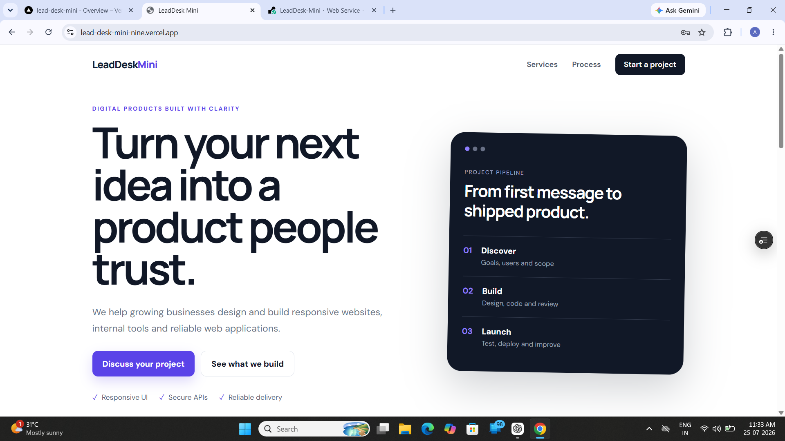
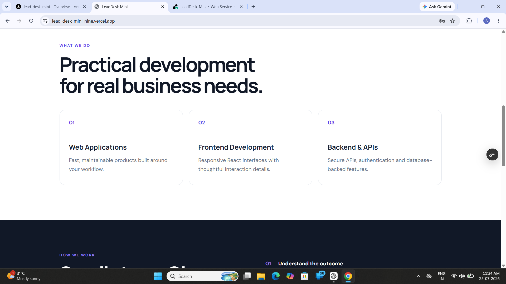
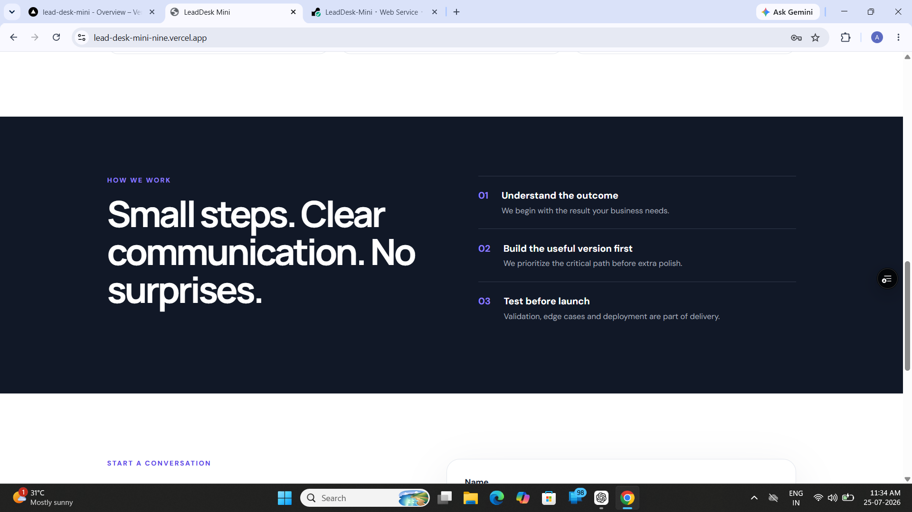
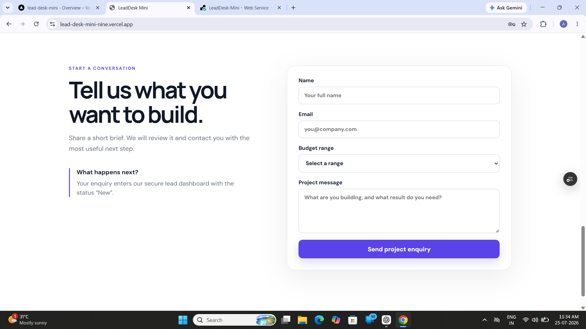
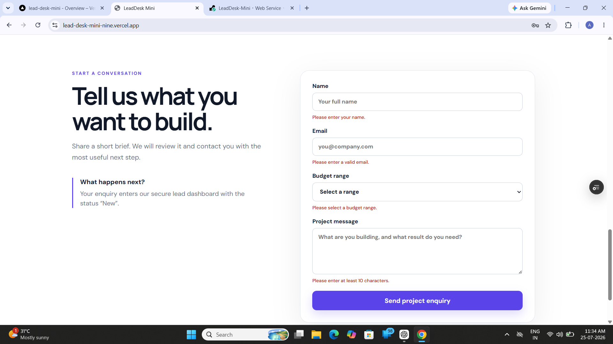
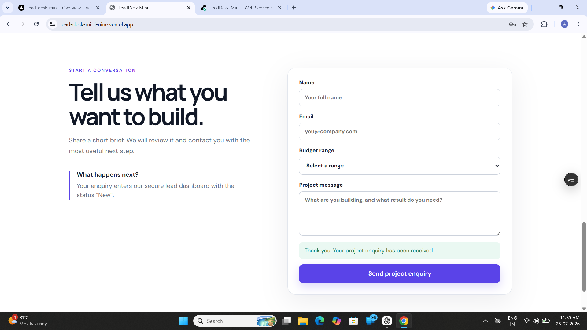
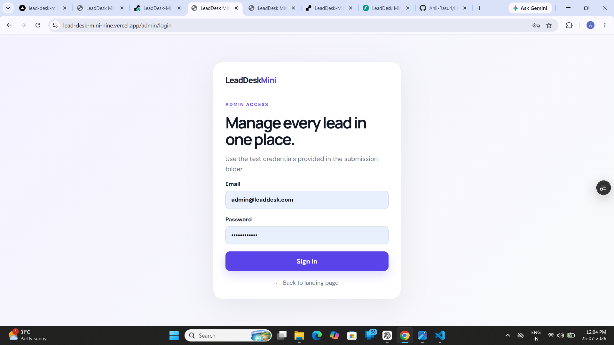
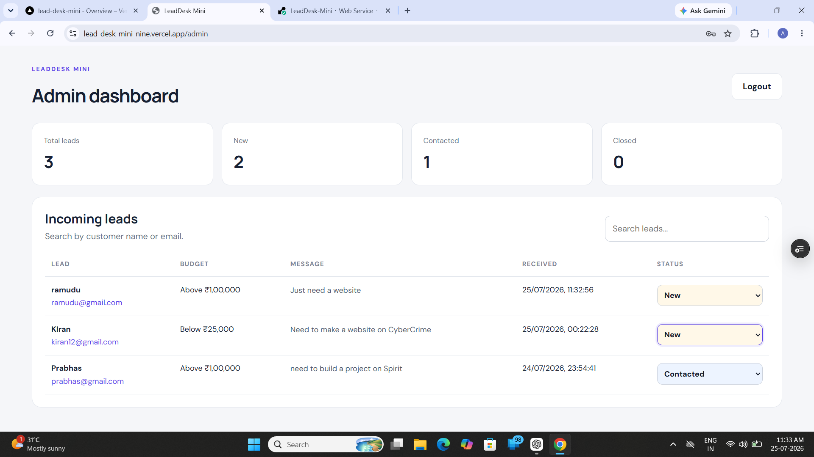
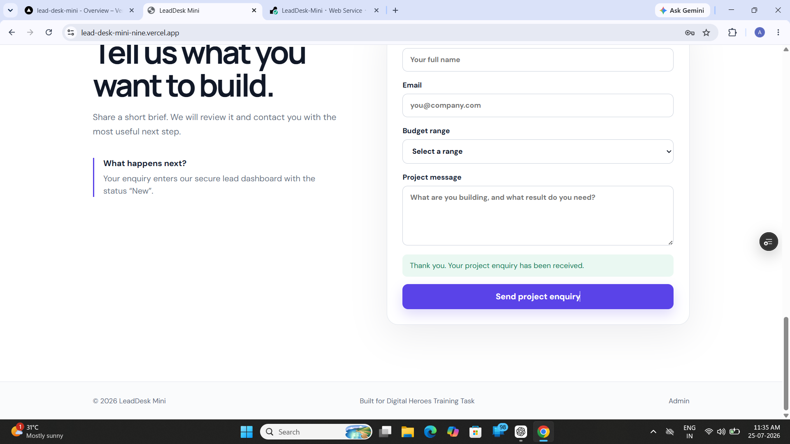

# LeadDesk Mini

A full-stack lead management application built for the **Digital Heroes Full Stack Development Assessment**.

---

# Live Demo

### Landing Page

https://lead-desk-mini-nine.vercel.app/

### Admin Login

https://lead-desk-mini-nine.vercel.app/admin/login

### Backend API

YOUR_RENDER_URL

https://leaddesk-mini-56hv.onrender.com

### API Documentation (Swagger)

YOUR_RENDER_URL/docs

https://leaddesk-mini-56hv.onrender.com/docs

### GitHub Repository

YOUR_GITHUB_REPO_URL

https://github.com/Anil-Rasuri/LeadDesk-Mini

### Loom Walkthrough

(Add your Loom video link after recording)

---

# Test Admin Credentials

Email

```
admin@leaddesk.com
```

Password

```
ChangeMe123!
```

---

# Features

- Public landing page
- Responsive design
- Lead enquiry form
- Client-side validation
- Server-side validation
- PostgreSQL database
- JWT authentication
- Secure admin login
- Protected admin dashboard
- Search leads
- Update lead status
- Status workflow (New → Contacted → Closed)

---

# Tech Stack

## Frontend

- React.js
- Vite
- React Router DOM
- Axios
- CSS

## Backend

- FastAPI
- SQLAlchemy
- Pydantic
- JWT Authentication
- bcrypt

## Database

- PostgreSQL (Supabase)

## Deployment

- Vercel
- Render

---

# Screenshots

## Landing Page



---

## Landing Page (Section)



---

## Services Section



---

## Lead Form



---

## Validation Error



---

## Successful Submission



---

## Admin Login



---

## Admin Dashboard



---

## Search Leads


---

## Search Leads



---

# Database

## Leads

| Column | Type |
|---------|------|
| id | Integer |
| name | String |
| email | String |
| budget | String |
| message | Text |
| status | String |
| created_at | DateTime |

## Admins

| Column | Type |
|---------|------|
| id | Integer |
| email | String |
| password_hash | String |
| created_at | DateTime |

---

# API Endpoints

| Method | Endpoint |
|---------|----------|
| GET | /health |
| POST | /api/leads |
| POST | /api/admin/login |
| GET | /api/admin/me |
| GET | /api/admin/leads |
| PATCH | /api/admin/leads/{id}/status |

---

# Local Setup

## Backend

```bash
cd Backend

python -m venv venv

venv\Scripts\activate

pip install -r requirements.txt

copy .env.example .env

uvicorn main:app --reload
```

Open:

```
http://127.0.0.1:8000/docs
```

## Frontend

```bash
cd Frontend

npm install

copy .env.example .env

npm run dev
```

Open:

```
http://localhost:5173
```

---

# Environment Variables

Backend

```
DATABASE_URL=
JWT_SECRET=
ADMIN_EMAIL=
ADMIN_PASSWORD=
FRONTEND_URLS=
```

Frontend

```
VITE_API_URL=
```

---

# Design Decisions

- Admin registration is disabled for security.
- Validation is implemented on both frontend and backend.
- Search functionality is performed on the backend for scalability.

---

# AI Usage

ChatGPT was used to review project structure, improve validation logic, assist with deployment troubleshooting, and refine documentation. The application was implemented, tested, debugged, and deployed manually.

---

# Future Improvements

- Email notifications
- Pagination
- Dashboard analytics
- Export to CSV
- Refresh tokens
- Role-based access control

---

# Note

> This project is hosted on Render's free tier. If the backend has been inactive, the first request may take around 30–60 seconds while the server wakes up.

---

# Digital Heroes Assessment

This project was developed as part of the **Digital Heroes Full Stack Development Assessment**.

Footer Credit:

**Built for Digital Heroes Training Task**

https://digitalheroesco.com